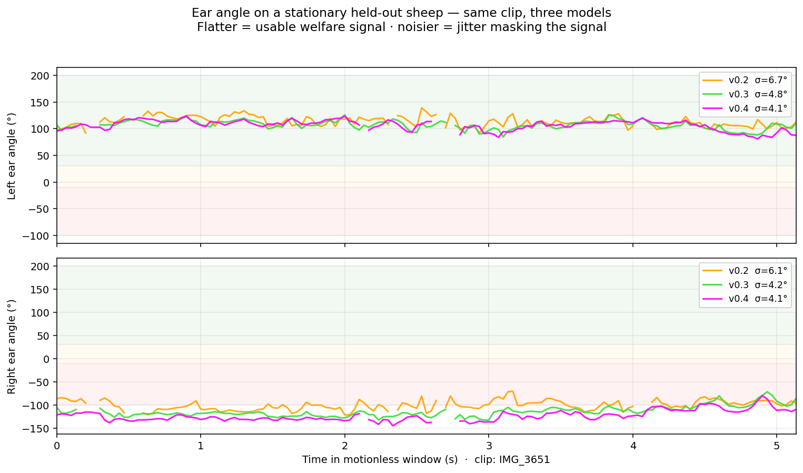
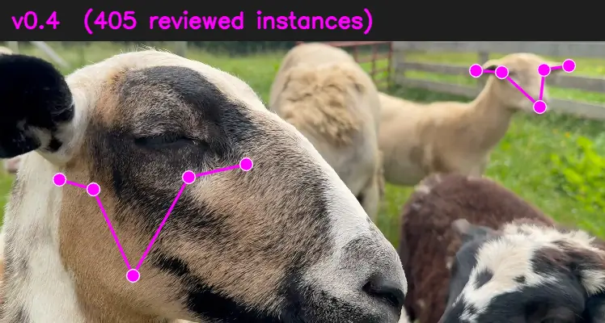

# SamSeesSheep

**A labeling pipeline and training workflow for sheep head keypoints. SAM 3 segments every sheep in a clip via text prompt; a small YOLO-pose model (trained from those annotations) is what eventually runs at the barn.**

Built and validated against a single Katahdin flock in Middletown, DE. Generalization to other breeds and conditions is future work.

*v0.4 · 405 reviewed instances · ~4° ear-angle σ on a held-out clip · stock YOLO produces zero keypoints*

> Part of an ongoing series applying AI to small-flock animal welfare.



*A sheep standing still should produce a flat ear-angle line. v0.2 bounces 6–7° on both ears. v0.4 holds within ~4°. The clip is held-out — never pushed to the labeler, never reviewed, NCC < 0.23 vs every training video.*

**Ear-angle residual jitter on the held-out clip (degrees, lower is more usable as a welfare signal):**

| | left ear σ | right ear σ |
|---|---|---|
| v0.2 | 6.71° | 6.07° |
| v0.3 | 4.82° | 4.21° |
| **v0.4** | **4.06°** | **4.09°** |

Stock YOLO (`yolo26n.pt`) produces **zero keypoints** on this clip. It can detect a "sheep" bounding box on ~35% of frames, but with no nose/ear landmarks the ear-angle measurement is *unmeasurable* until you label your own flock and train a keypoint head against it.

Full per-keypoint σ tables, methodology, and the full benchmark report: [`docs/v0.4-benchmark.md`](docs/v0.4-benchmark.md).

### Same clip, different models

<p align="center">
  
  
</p>

*Left: v0.4 alone (magenta keypoints, 405 reviewed training instances). Right: v0.2 (orange) and v0.4 (magenta) on the same frames. v0.2 places ear tips in mid-air and confuses left vs right; v0.4 lands every keypoint on anatomy on every frame.*

Static stills grid: [`docs/v0.2-vs-v0.4-stills.png`](docs/v0.2-vs-v0.4-stills.png). Full-length comparison videos: [`v0.2-vs-v0.4-IMG_3651.mp4`](sheep-yolo/artifacts/v0.2-vs-v0.4-IMG_3651.mp4) (hero, 2-up) and [`v0.2-vs-v0.3-vs-v0.4-IMG_3651.mp4`](sheep-yolo/artifacts/v0.2-vs-v0.3-vs-v0.4-IMG_3651.mp4) (3-up curve).

## Scope — read this first

This repo owns **labeling and training**. It is not a welfare instrument, and no claims in the interface should be read as clinical.

- **What it does:** segments **every sheep** in a short clip via SAM 3 Video text prompts (`"sheep head"`, `"sheep ear"`, `"sheep nose"`), producing head/ear/nose masks per instance per frame. Presents a keypoint labeling UI that lets me (the reviewer) confirm or correct SAM's auto-placed nose tip, ear bases, and ear tips for **every detected instance** (schema v2: `instances[]` per frame). Exports the reviewed keypoints as a YOLO-pose training dataset. On a GPU pod, trains a small YOLO-pose model against that dataset. Ships the trained weights to the inference repo.
- **What it does not do:** detect pain, score welfare, generalize across flocks, or validate against documented stress events. Validation against stress events is future work. Inference and σ-benchmarking happen in a separate repo (see below).

The ear-angle thresholds shown in the labeler's observability chart come from clinical studies ([McLennan & Mahmoud 2019](https://pmc.ncbi.nlm.nih.gov/articles/PMC6523241/), [Reefmann et al. 2009](https://www.sciencedirect.com/science/article/pii/S0168159109001610), [Boissy et al. 2011](https://www.sciencedirect.com/science/article/pii/S0031938411000369)). Applying them to ambient pasture observation is a real and unresolved gap. [`VALIDATION.md`](./VALIDATION.md) is the contract.


## How it's built

```
Video clip (phone capture, 15–30s, 1080p)
   │
   ▼
Frame extraction (2 fps, up to ~512 px max dim)
   │
   ▼
SAM 3 Video — text-prompted segmentation
   prompts: "sheep head", "sheep ear", "sheep nose"
   finds every instance matching each prompt; tracks them across frames
   (three sessions on 24 GB GPU, two on 6 GB)
   │
   ▼
Auto-derived keypoint candidates per instance per frame
   nose tip · L-ear base · R-ear base · L-ear tip · R-ear tip
   (image-space L/R, flip_idx [0, 2, 1, 4, 3] for YOLO-pose augmentation)
   │
   ▼
Labeling UI — human reviews each frame, drags dots for every
   instance, v=2 on accept (schema v2: instances[] per frame)
   │
   ▼
Export — data/labels/exports/sheep-pose-v0.N/  (YOLO-pose format,
         portable data.yaml, hash-based train/val split,
         one .txt label line per instance)
   │
   ▼
yolo train  (on the pod's GPU; sync-streamed from laptop via SSH)
   │
   ▼
best.pt → synced to sheep-yolo/weights/  (~10 MB)
```


Alongside the labeling flow, the UI also produces a per-frame ear-angle timeline with SPFES-referenced threshold bands — useful for eyeballing a clip but not the primary artifact. See "The labeler's per-clip ear-angle chart" below.

## Related repo — sheep-yolo

The work splits across two repos:

| Repo | Owns |
|---|---|
| **sheep-seg** (this one) | SAM 3 labeling UI, dataset export, on-pod YOLO-pose training, script-side orchestration |
| **sheep-yolo** | Inference pipeline, σ-on-motionless-sheep benchmark, demo UI — consumes `best.pt` produced here |

Heavy compute (SAM 3, YOLO training) runs on a cloud GPU pod (RunPod — 4090 / L40S / H100, whatever's available) that clones this repo. Inference runs locally on a 6 GB GTX 1660 Ti using the trained weights — which is the whole point: train once in the cloud, infer forever on hardware I own. [`scripts/README.md`](./scripts/README.md) explains the pod-side orchestration in detail.

## Run it — labeling

For a local-only labeling session (small clips, clean audio, 6 GB GPU fine):

```bash
git clone https://github.com/antonemking/SamSeesSheep.git
cd SamSeesSheep
uv sync
uv run uvicorn backend.main:app --host 0.0.0.0 --port 8000
```

Open `http://localhost:8000`. Drop a sheep video. Wait 1–3 minutes for SAM 3 to finish — it finds every sheep matching the text prompts automatically; no clicking required. Then review each frame in the labeler, dragging keypoints onto every detected instance. Shortcuts: `A` = accept SAM's candidates, `Enter` = save and advance, `S` = skip.

**Requirements:** Python 3.11, CUDA GPU (6 GB runs a reduced 2-session pipeline; 24 GB runs the full 3-session pipeline). First run downloads SAM 3 (~3 GB) from Hugging Face — you need an approved HF token for `facebook/sam3`.

## Run it — training (on a pod)

Local 6 GB VRAM can't fit the YOLO training run (batch=8 imgsz=640). Training happens on a cloud GPU pod. End-to-end orchestration is in [`scripts/README.md`](./scripts/README.md); the short version:

```bash
# On the pod (RunPod cloud GPU, SSH'd in):
bash scripts/start_pod_server.sh        # labeling server

# On the laptop (after dataset reaches ~100 reviewed frames):
./scripts/train_on_pod.sh               # runs yolo train on the pod's GPU
./scripts/sync_weights_from_pod.sh      # pulls best.pt to sheep-yolo/weights/
```

Only `best.pt` (~10 MB) crosses the network. The dataset stays on the pod.

### Backup — where the dataset actually lives

The labeling work is the single most irreplaceable thing in this project. It's protected in two layers:

1. **RunPod Network Volume.** On the pod, `data/labels/` is a symlink to a Network Volume (mount path `/mnt/labels`, attached via the RunPod UI at pod-deploy time). Volumes survive Stop/Resume *and* Terminate / spot preemption; container disk does not. `scripts/start_pod_server.sh` refuses to boot if the mount is missing, so labels never silently land on ephemeral disk. Setup in [`docs/CLOUD.md`](./docs/CLOUD.md#1a-create-the-network-volume-durable-labels-storage).
2. **Laptop rsync mirror.** `./scripts/backup_dataset.sh` pulls the full `data/labels/` tree to `~/Backups/sheep-seg/labels/`. Manual, weekly. Covers RunPod-outage / volume-delete / billing-lapse scenarios the volume alone can't.

## The labeler's per-clip ear-angle chart

This is a **different** chart from the model-comparison one at the top. While reviewing a clip in the labeler, the dashboard shows a per-frame ear-angle timeline for *that one clip*. It's not a measurement instrument — it exists so I can spot obviously-wrong keypoint placements at a glance during review.


- **Y axis:** ear angle relative to the head's dorsal axis. Positive = up/forward, negative = back/down.
- **Bands:** green ≥ 30° (up/alert), amber −10°–30° (neutral), red ≤ −10° (down/back), per SPFES literature.
- **Two traces:** left ear (blue), right ear (orange). Asymmetry shows up as trace divergence.

Trust deltas, not absolutes. A within-animal EUP% change before/after a documented event is a defensible delta. Cross-animal averages are not claims this dataset can support yet.

## Roadmap / future work

- **Validation against documented stress events** (hoof trim, tagging, separation, startle). This is the welfare-instrument project — separate undertaking with a capture protocol and a kill criterion.
- **Continuous monitoring** — trained model running at the water trough / handling chute, flagging ear-posture anomalies over time windows.
- **σ-benchmark across dataset versions** — formal comparison of v0.1 → v0.N (currently v0.4) trained models against a motionless-sheep baseline. The reproducible bench script is [`sheep-yolo/scripts/bench_held_out.py`](sheep-yolo/scripts/bench_held_out.py).
- **Real-time mode** — current pipeline is batch; a streaming inference path on edge hardware comes after the v0.N model proves out.

**Kill criterion for the welfare-instrument follow-up (not this artifact):** if fewer than 70% of documented stress events show measurable EUP% change once the trained YOLO-pose model is running, the welfare project ends and the writeup of what failed is itself the deliverable.

## References

- McLennan, K.M. & Mahmoud, M. (2019). [Development of an Automated Pain Facial Expression Detection System for Sheep](https://pmc.ncbi.nlm.nih.gov/articles/PMC6523241/). *Animals*, 9(4), 196.
- Reefmann, N. et al. (2009). Ear and tail postures as indicators of emotional valence in sheep. *Applied Animal Behaviour Science*.
- Boissy, A. et al. (2011). Ear postures as indicators of emotional valence in sheep. *Physiology & Behavior*.
- Ravi, N. et al. (2024/25). [SAM 2 / SAM 3](https://ai.meta.com/sam). Meta AI.
- [Ultralytics YOLO](https://github.com/ultralytics/ultralytics) — training and inference for YOLO-pose.

## Built by

[Antone King](https://github.com/antonemking) — applying AI to agriculture and movement science.

---

*Read [`VALIDATION.md`](./VALIDATION.md). It's the contract.*

[MIT License](./LICENSE) — Animal welfare research belongs in the commons.
