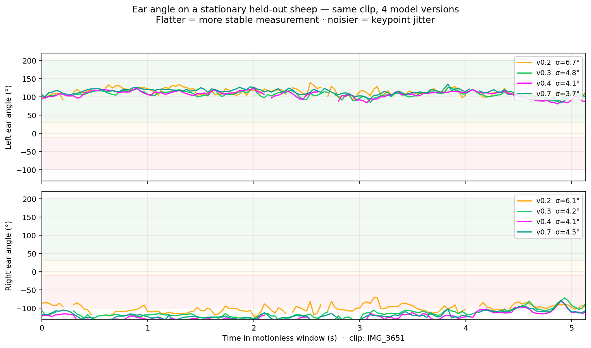
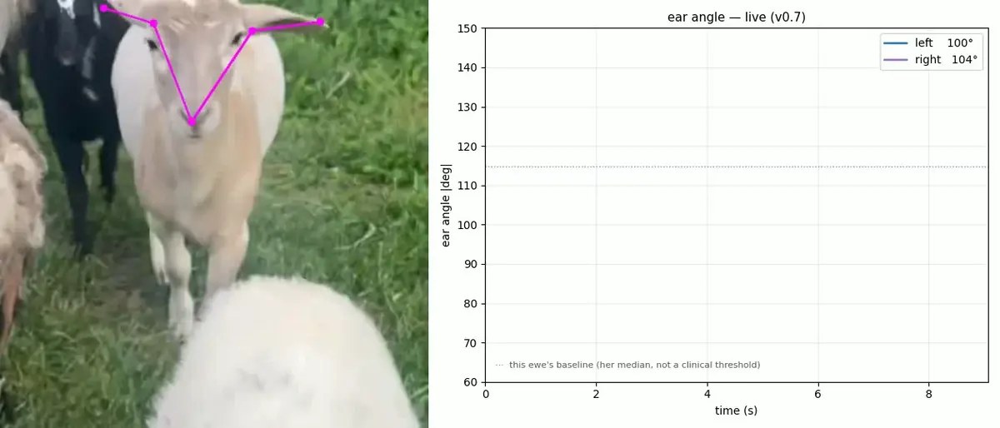
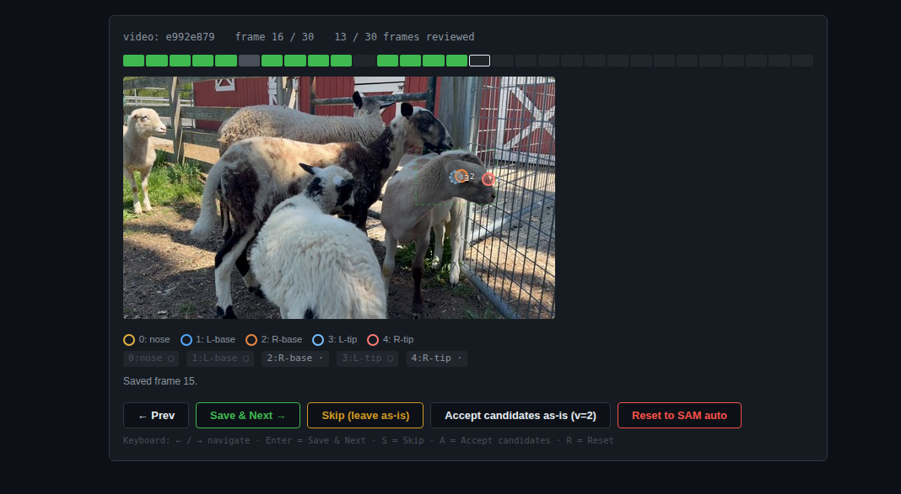

# SamSeesSheep

**SAM 3 Video finds every sheep in a clip via text prompts. A human reviews keypoints. A small YOLO-pose model (~6 MB) trains on those annotations and runs inference on a 6 GB GPU at the barn.**

Built and validated against a single Katahdin flock in Middletown, DE. Generalization to other breeds and conditions is future work.

*v0.7 · 523 reviewed instances · σ_avg 2.84° ear-angle on a held-out clip · stock YOLO produces zero keypoints*

<p align="center">
  
</p>

*v0.7 reads every sheep facing the camera at once — six ewes here, one live ear-angle lane each. A measurement instrument, not a welfare readout.*

```bash
git clone https://github.com/antonemking/SamSeesSheep.git
cd SamSeesSheep
uv sync
uv run uvicorn backend.main:app --host 0.0.0.0 --port 8000
# Open http://localhost:8000, drop a video, review keypoints, export a dataset.
```

## Why this exists

Off-the-shelf object detectors can find a sheep bounding box on ~35% of frames, but produce no keypoints — ear angle is literally unmeasurable without a custom keypoint head. Training one requires labeled data, which requires either weeks of manual annotation or a foundation model that can auto-segment. SAM 3 Video, prompted with plain English ("sheep head", "sheep ear", "sheep nose"), segments every instance in a clip automatically, turning hours of per-frame bounding-box work into a review-and-correct labeling session. The result is a tiny edge-runnable model that places five keypoints on every sheep the camera sees.

## Results

Ear-angle residual σ on a held-out clip — never pushed to the labeler, never reviewed, visually distinct from every training clip:

| | left ear σ | right ear σ |
|---|---|---|
| v0.2 | 6.71° | 6.07° |
| v0.3 | 4.82° | 4.21° |
| v0.4 | 4.06° | 4.09° |
| v0.5 | 3.66° | 4.30° |
| v0.6 | 4.65° ⚠️ | 3.55° |
| **v0.7** | **3.70°** | **4.46°** |

*This table is on the IMG_3651 held-out clip (never seen by labeler or trainer). On a second held-out clip (Test_Clip_Morning, different lighting and flock arrangement), v0.7 achieves σ_avg = 2.84° (left 2.39°, right 3.29°) — ~7.1% of the SPFES 40° classification band. ⚠️ v0.6 shows right ear at best-ever 3.55° but left ear regressed to 4.65° — more data does not monotonically improve every keypoint.*

<p align="center">
  
</p>

*A stationary sheep should produce a flat ear-angle trace; deviation from flat is the measurement noise floor. v0.2 (orange) bounces 6–7°; by v0.4 (magenta) both ears hold ~4°, and v0.7 (teal) overlaps v0.4 — the gain saturates after v0.4 rather than improving indefinitely.*

Training progression — same model architecture (YOLO26n-pose, 2.5 M params), same recipe, only labeled-data scale changes:

| | v0.2 | v0.3 | v0.4 | v0.5 | v0.6 | v0.7 |
|---|---|---|---|---|---|---|
| Training instances | 98 | 313 | 405 | 428 | 471 | **523** |
| Training videos | 3 | 6 | 8 | 9 | 10 | **11** |
| val mAP50-95 (pose) | 0.479 | 0.643 | 0.732 | — | — | — |
| Residual σ (mean, 5 kpts) | 10.89 px | 8.90 px | 7.70 px | — | — | — |

Stock `yolo26n.pt` produces zero keypoints on the same clip. The keypoint head is something you grow against your own animals.

<p align="center">
  
</p>

*v0.7 on the held-out IMG_3651 clip: five keypoints lock onto the head (left) while the left and right ear angles are read out frame by frame (right). A near-stationary sheep yields a roughly flat trace — the residual jitter around it is the measurement noise floor (σ ≈ 4° on this clip).*

Current v0.7 held-out benchmark — full training progression, both held-out clips, and the two-clip comparison: [`docs/v0.7-benchmark.md`](docs/v0.7-benchmark.md). Per-keypoint σ tables and the residual-σ methodology are in the v0.2→v0.4 report: [`docs/v0.4-benchmark.md`](docs/v0.4-benchmark.md).

## How it works

```
Video clip (phone capture, 15–30s, 1080p)
   │
   ▼
Frame extraction (2 fps, up to ~512 px max dim)
   │
   ▼
SAM 3 Video — text-prompted segmentation
   prompts: "sheep head", "sheep ear", "sheep nose"
   finds every instance matching each prompt; tracks them across frames
   │
   ▼
Auto-derived keypoint candidates per instance per frame
   nose tip · L-ear base · R-ear base · L-ear tip · R-ear tip
   (image-space L/R, flip_idx [0, 2, 1, 4, 3] for YOLO-pose augmentation)
   │
   ▼
Labeling UI — human reviews each frame, drags dots for every
   instance, v=2 on accept (schema v2: instances[] per frame)
   │
   ▼
Export — data/labels/exports/sheep-pose-v0.N/ (YOLO-pose format,
         hash-based train/val split, one .txt label line per instance)
   │
   ▼
yolo train (on cloud GPU; only best.pt ~6 MB crosses the network)
   │
   ▼
best.pt → sheep-yolo/weights/ → inference + σ benchmark on 6 GB local GPU
```



## Repository layout

| Directory | Owns |
|---|---|
| `backend/` | SAM 3 pipeline, labeling API, keypoint export |
| `frontend/` | Browser labeling UI, dashboard, ear-angle chart |
| `scripts/` | Pod orchestration — push clips, train, back up, sync weights |
| `data/labels/` | Reviewed annotations (symlink to durable network volume on pod) |
| `docs/` | Benchmarks, cloud ops guide, architecture notes |
| `sheep-yolo/` | Inference pipeline, σ-on-motionless-sheep benchmark, demo UI |
| `assets/` | Hero images, showcase media |

## Scope — what this is / what this is not

**What this is:** a labeling and training pipeline for sheep head keypoints. SAM 3 auto-places candidates. A human reviews them. Reviewed frames export to a YOLO-pose dataset. A small model trains on a cloud GPU. Weights live in `sheep-yolo/weights/` within this monorepo, which also owns inference and benchmarking.

**What this is not:** a welfare instrument. A pain detector. A validated dataset against stress events. A cross-flock generalizer. The ear-angle thresholds shown in the labeler come from published clinical literature — applying them to ambient pasture observation is a real and unresolved gap.

[`VALIDATION.md`](./VALIDATION.md) is the contract. Read it.

## Quick links

- **[SETUP.md](./SETUP.md)** — complete reproducibility guide (prerequisites, local labeling, cloud GPU training, inference)
- **[ARCHITECTURE.md](./ARCHITECTURE.md)** — detailed technical architecture for researchers and engineers
- **[DATA_FORMAT.md](./DATA_FORMAT.md)** — review.json schema, YOLO-pose export format, keypoint v-flag semantics
- **[docs/v0.7-benchmark.md](./docs/v0.7-benchmark.md)** — current held-out benchmark (v0.7, two clips, training progression)
- **[docs/v0.4-benchmark.md](./docs/v0.4-benchmark.md)** — 3-way (v0.2→v0.4) report with per-keypoint σ tables + residual-σ methodology
- **[VALIDATION.md](./VALIDATION.md)** — what this project claims and what it explicitly does not
- **[LICENSE](./LICENSE)** — MIT

## References

- McLennan, K.M. & Mahmoud, M. (2019). [Development of an Automated Pain Facial Expression Detection System for Sheep](https://pmc.ncbi.nlm.nih.gov/articles/PMC6523241/). *Animals*, 9(4), 196.
- Reefmann, N. et al. (2009). Ear and tail postures as indicators of emotional valence in sheep. *Applied Animal Behaviour Science*.
- Boissy, A. et al. (2011). Cognitive sciences to relate ear postures to emotions in sheep. *Animal Welfare*.
- Ravi, N. et al. (2024/25). [SAM 2 / SAM 3](https://ai.meta.com/sam). Meta AI.
- [Ultralytics YOLO](https://github.com/ultralytics/ultralytics) — training and inference for YOLO-pose.

## Built by

[Antone King](https://github.com/antonemking) — applying AI to agriculture and movement science. Part of [Lorewood Labs](https://lorewood.dev).

---

MIT License — Animal welfare research belongs in the commons.
