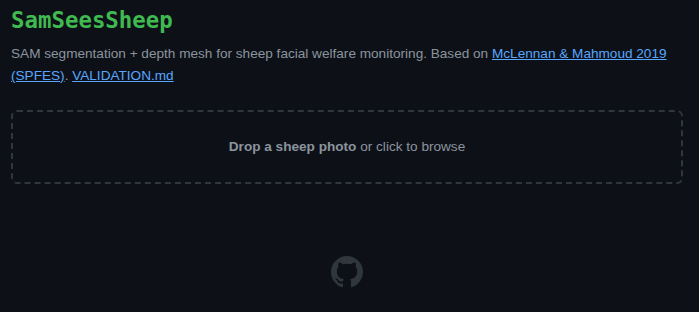
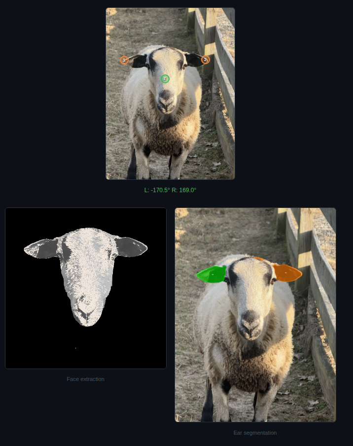
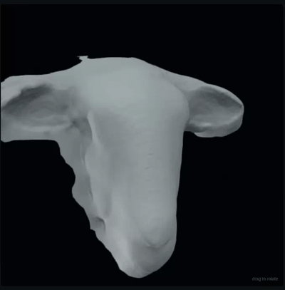

# SamSeesSheep

**Segment a sheep's face from a smartphone photo. Extract ear position. Build a depth mesh from a single image of my sheep.**

> Part 1 of an ongoing series applying AI to small-flock animal welfare.


---

## The problem

Small ruminants are prey animals. They hide illness. By the time you notice something's off, you're often already behind. If you don't have a quality livestock vet nearby, that window gets even smaller.

Industrial operations have precision livestock farming tools — cameras, sensors, per-animal analytics. Small-flock owners have nothing.

## The research

In 2019, McLennan and Mahmoud at the Universities of Chester and Cambridge published a framework for [automated sheep pain detection](https://pmc.ncbi.nlm.nih.gov/articles/PMC6523241/) using the **Sheep Pain Facial Expression Scale (SPFES)**. The system detects sheep faces, maps facial landmarks (ears, eyes, nostrils, mouth), and scores pain indicators automatically.

The SPFES has been validated against clinical conditions like foot rot and mastitis. Ear position alone — whether ears are up/alert, neutral, or pinned back — is one of the strongest single-frame indicators.

Meanwhile, Meta's Segment Anything Model (SAM) made foundation-level segmentation free. The gap is the join: **nobody has used the foundation-model shift to put a published welfare signal into a homesteader's hands.**

## The pipeline

### 1. Upload + click 3 points + segmentation

Upload a smartphone photo. No special hardware.



Click 3 points: face center (**F**), then each ear tip (**1**, **2**). SAM segments the head and isolates each ear using positive/negative prompts. The head mask extracts a clean face on black background. Ear masks are color-coded and angles are computed relative to the head midline using PCA.



**Ear angle thresholds from published literature:**
- &gt; 30&deg; above horizontal → **up/alert**
- -10&deg; to 30&deg; → **neutral**
- &lt; -10&deg; → **down/back** (potential pain indicator)

### 2. Depth mesh

Depth Anything V2 estimates monocular depth from the cropped head region. Poisson surface reconstruction builds a smooth 2.5D mesh. The turntable rocks &plusmn;40&deg; to show facial topology.



## Architecture

```
Smartphone photo
       │
       ▼
   SAM 2.1 (facebook/sam2.1-hiera-small)
   3-point prompt: face + ear tips
       │
       ├──► Head mask ──► Face extraction (clay render)
       │
       ├──► Ear masks ──► PCA angle extraction ──► EUP% metric
       │
       └──► Depth Anything V2 ──► Poisson reconstruction ──► 2.5D mesh
```

| Component | Model | Size | Runs on |
|---|---|---|---|
| Segmentation | SAM 2.1 hiera-small | ~350 MB | GPU (GTX 1660 Ti) |
| Depth estimation | Depth Anything V2 Small | 50 MB | GPU |
| Mesh reconstruction | Open3D Poisson | CPU | CPU |
| Ear angle extraction | PCA + ellipse fitting | No model | CPU |

## What this measures (and doesn't)

Read [`VALIDATION.md`](./VALIDATION.md) first. It's the contract.

**Measures:** Geometric position of sheep ears in single frames. EUP% (Ear-Up Percentage) as an aggregate metric over time.

**Does not measure:** Pain, welfare, emotion, disease, cross-flock generalization, cross-breed generalization, or anything in goats. The thresholds come from clinical validation studies. Applying them to ambient pasture observation is a real and unresolved gap. This project says so out loud.

**Dataset:** 5 sheep, one breed, one homestead, one phone, one non-veterinary annotator. Trust deltas, not absolutes.

## Run it yourself

```bash
git clone https://github.com/antonemking/SamSeesSheep.git
cd SamSeesSheep
uv sync
uv run uvicorn backend.main:app --host 0.0.0.0 --port 8000
```

Open `http://localhost:8000`. Upload a sheep photo. Click the face, then each ear tip.

**Requirements:** Python 3.12+, CUDA GPU recommended (runs on CPU but slow). SAM 2.1 and Depth Anything V2 models download automatically on first run (~400 MB total).

## What's next

This is a feasibility study, not a product. The 4-weekend plan:

1. **Weekend 1 — Watch.** Observation + SAM segmentation quality on real photos. **(done)**
2. **Weekend 2 — Build.** Working ear-angle extractor + depth mesh pipeline. **(done, this repo)**
3. **Weekend 3 — Measure.** EUP% across documented stress events.
4. **Weekend 4 — Decide.** Pass or kill against the criterion.

**Kill criterion:** If fewer than 70% of documented stress events show measurable ear-position change, the project ends. The writeup of what failed is itself the deliverable.

**Roadmap:**
- Upgrade to [SAM 3](https://huggingface.co/facebook/sam3) — text-prompted segmentation ("sheep head", "left ear") could replace manual click annotation entirely
- Camera placement at water troughs, feeders, and handling chute for automated capture
- Fine-tune against SPFES scoring rubric with labeled data

## References

- McLennan, K.M. & Mahmoud, M. (2019). [Development of an Automated Pain Facial Expression Detection System for Sheep](https://pmc.ncbi.nlm.nih.gov/articles/PMC6523241/). *Animals*, 9(4), 196.
- Reefmann, N. et al. (2009). Ear and tail postures as indicators of emotional valence in sheep. *Applied Animal Behaviour Science*.
- Kirillov, A. et al. (2023). [Segment Anything](https://segment-anything.com/). Meta AI.
- Yang, L. et al. (2024). [Depth Anything V2](https://github.com/DepthAnything/Depth-Anything-V2). 

## Built by

[Antone King](https://github.com/antonemking) - I apply AI to agriculture and movement science

---

*Read [`VALIDATION.md`](./VALIDATION.md). It's the contract.*

[MIT License](./LICENSE) — Animal welfare research belongs in the commons.
